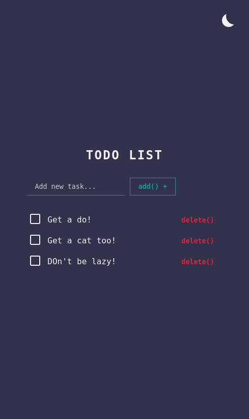

# Todo app concept with theme toggler

A small app concept idea just cu sharpen some of my skills

## Table of contents

- Todo app concept with theme toggler
  - [Table of contents](#table-of-contents)
  - [Overview](#overview)
    - [The challenge](#the-challenge)
    - [Screenshot](#screenshot)
    - [Links](#links)
  - [My process](#my-process)
    - [Built with](#built-with)
    - [What I learned](#what-i-learned)
    - [Continued development](#continued-development)
      - [For this project](#for-this-project)
  - [Author](#author)

## Overview

### The challenge

Users should be able to:

- Add, remove, toggle todos and save them to local storage
- The app should detect user theme preference, apply it and save it to local storage
  -Futhermore, user could change the theme and save it, no matter their system settings

### Screenshot

### Links

- Live Site URL: [View live demo](https://alinmercasi.github.io/order-summary-component-main/)

## My process

### Built with

- Semantic HTML5 markup
- CSS custom properties
- Flexbox
- Mobile-first workflow
- CSS Animations
- Local storage

### What I learned

- It helped me get some practice on how local storage work
- Make good use of CSS custom properties
- Understand some javascript events, as 'animationend'
- Work with arrays and objects
- Understand some javascript prototyping concepts working with classes
- Working with DOM from javascript
- Basic state management
- Make use of CSS animations, transforms and transitions

### Continued development

- To step into more advanced concepts of javascript DOM manipulation before learning any framework
- To be more organized :)
- Practice, practice, practice!
  #### For this project
  - I would like to use svg on theme toggler button for a smoother ux an to create more complex animations
  - To be able to edit todos an update them in local storage. Maybe I would do this using 'contenteditable' attribute
  - Add some micro interactions when some events are fired (ex: when adding or removing todos)

## Known bugs

- That ugly border on the theme toggle button (it has something to do with overflow hidden on the button itself, but I can't figure out why yet)
- On responsive mode, the theme toggle button register ehe click/tap even if you click like 50% percent of his height under it. Futhermore, sometimes does not register if you click on its top half.

## Author

- Alin Mercasi
